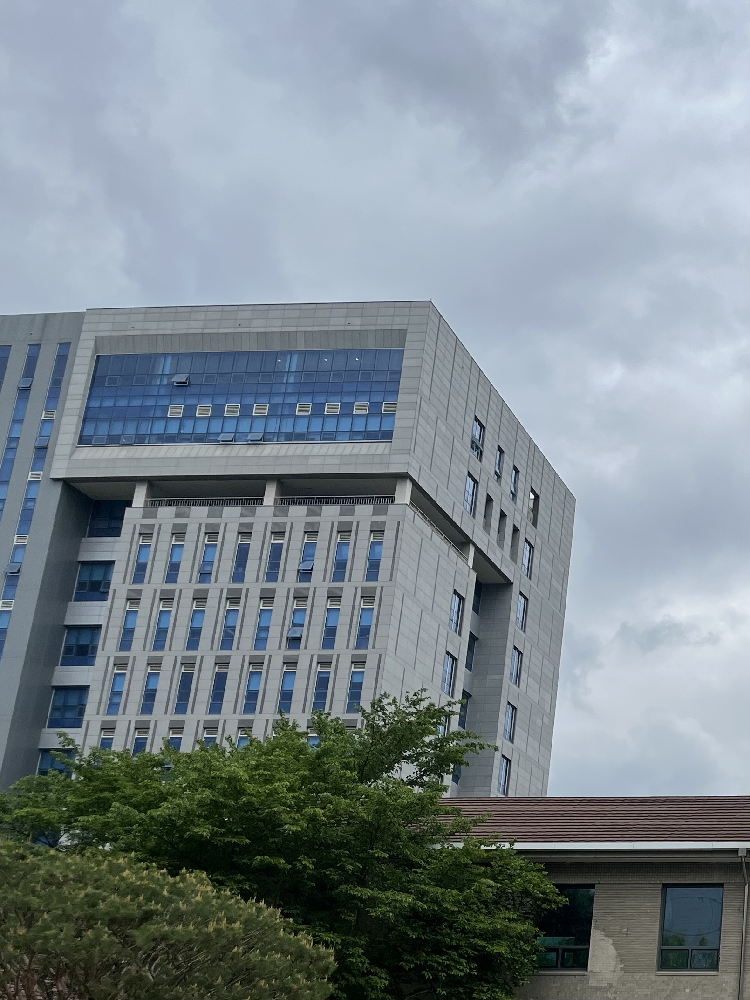
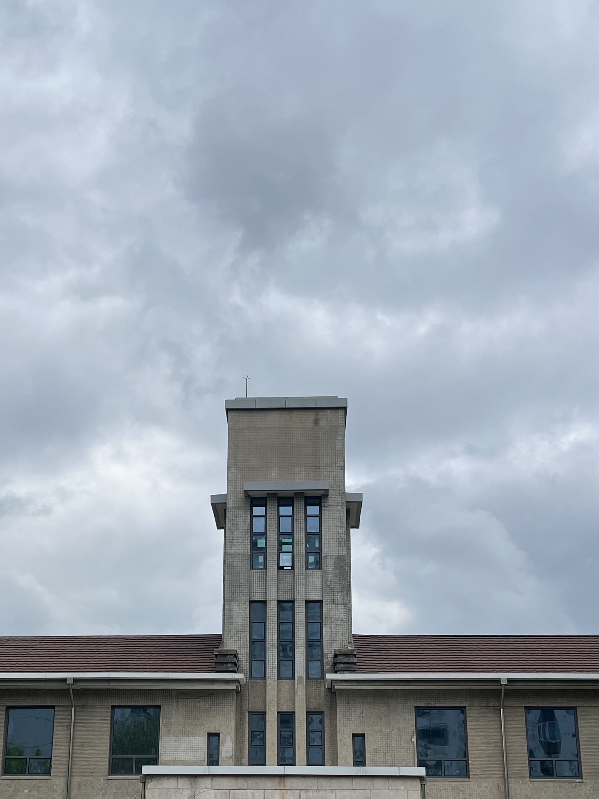
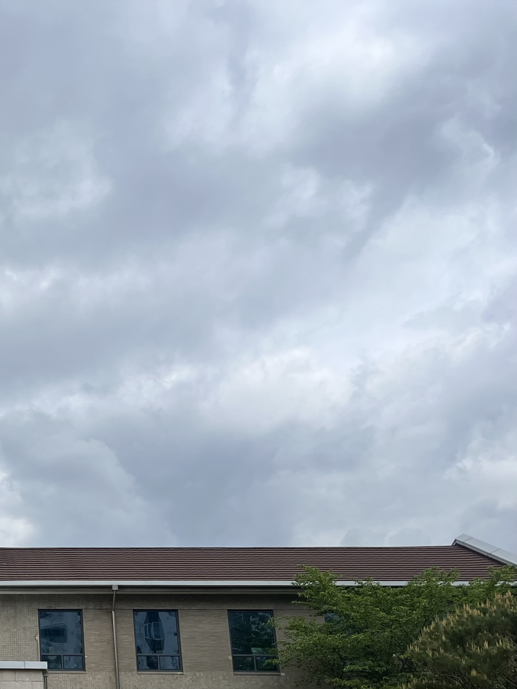
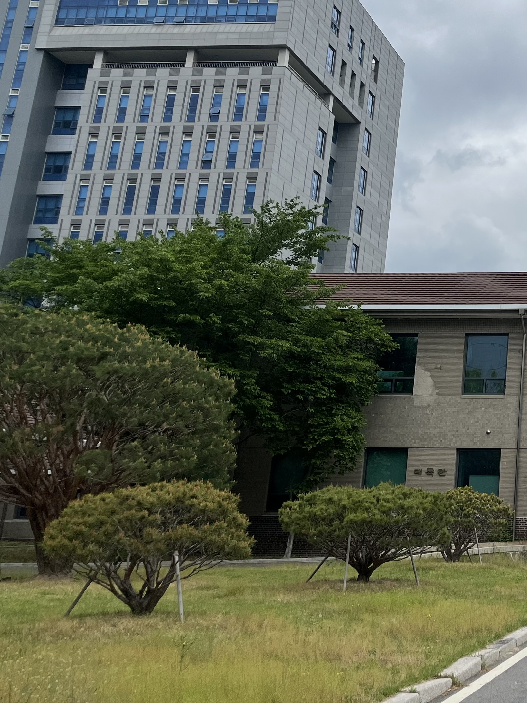
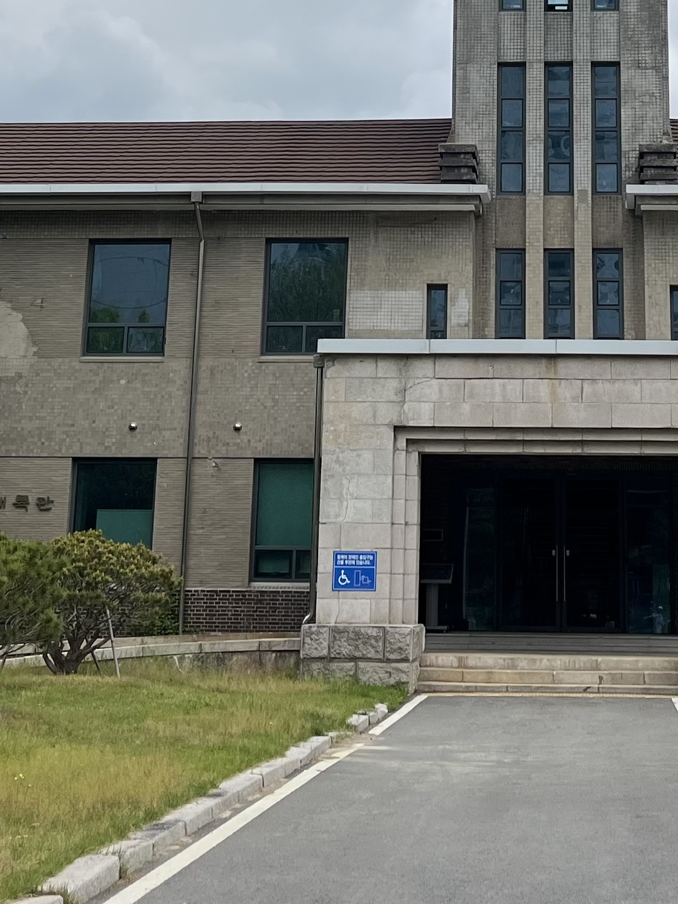
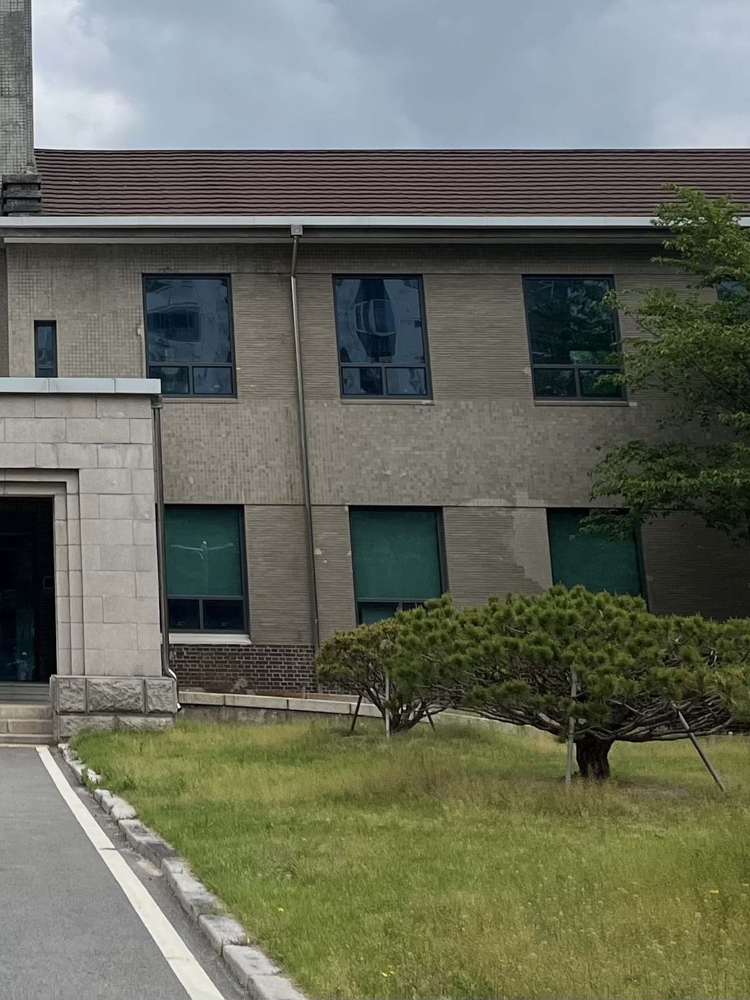
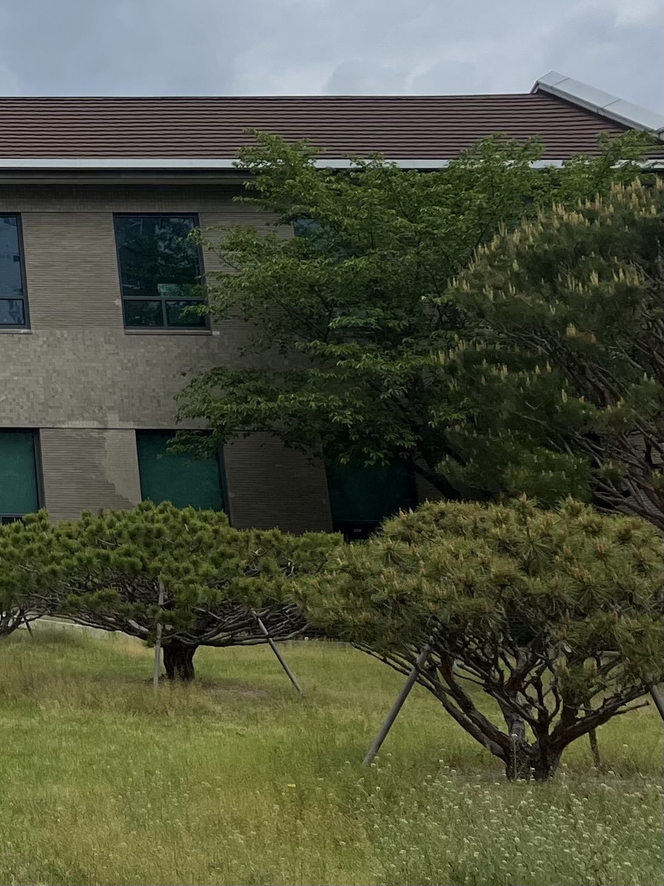
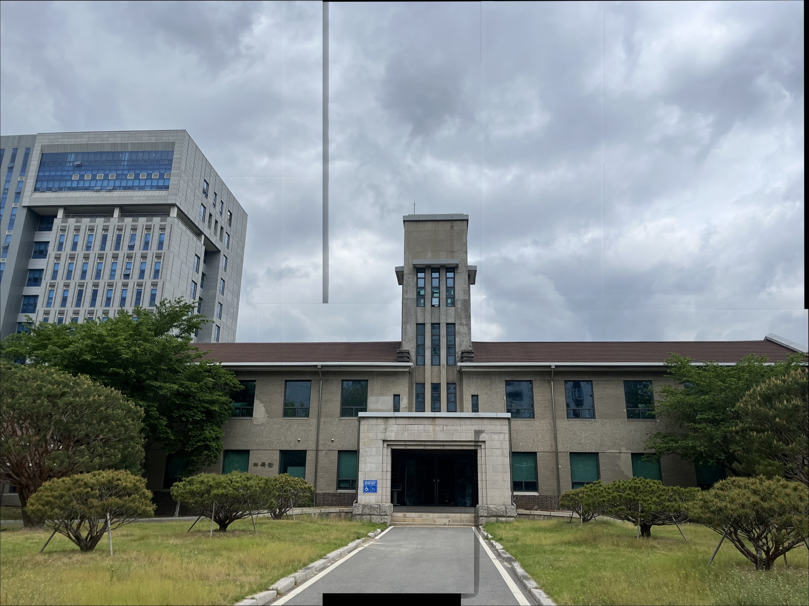

# PicPuzzle
Automatically stitches multiple overlapping images into a single large image

## 입력 이미지

<table>
  <tr>
    <td></td>
    <td></td>
    <td></td>
    <td></td>
    <td></td>
    <td></td>
    <td></td>
  </tr>
</table>

## 결과



## 기능

### 핵심 파이프라인
1. **특징점 검출 & 기술자 추출** — SIFT 기반 키포인트 및 디스크립터 추출
2. **특징점 매칭** — BFMatcher + Lowe's ratio test (임계값: 0.75)
3. **호모그래피 추정** — RANSAC 기반 강인한 호모그래피 계산
4. **이미지 워핑** — `warpPerspective`를 이용한 원근 변환
5. **자동 순서 결정** — 매칭 점수를 기반으로 최적의 스티칭 순서를 자동 결정

### 추가 기능: 멀티밴드 블렌딩 (Laplacian Pyramid)
이미지 경계에서 단순히 픽셀을 덮어쓰는 대신, 4단계 라플라시안 피라미드를 이용한 멀티밴드 블렌딩을 적용했습니다. 겹치는 영역에 소프트 그래디언트 마스크를 적용하여 이미지 간 경계선이 자연스럽게 연결됩니다.

## 실행 환경

```
python >= 3.8
opencv-python
numpy
```

패키지 설치:
```bash
pip install opencv-python numpy
```

## 사용법

```bash
# 기본 실행: 현재 디렉토리의 image1.jpg ~ image6.jpg 자동 로드
python image_stitching.py

# 직접 이미지 지정
python image_stitching.py img1.jpg img2.jpg img3.jpg ...
```

결과 이미지는 `result.jpg`로 저장됩니다.

## 참고 사항

- 가장 긴 변이 1600px을 초과하는 이미지는 자동으로 리사이즈됩니다
- 스티칭 순서는 특징점 매칭 점수를 기반으로 자동 결정됩니다
